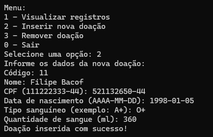

# Trabalho da Disciplina `Programação de Sistemas I`

## Objetivo

O objetivo deste projeto é desenvolver um programa em Java que permita manipular um arquivo CSV contendo registros de doações de sangue. O programa permite:

1. **Leitura** de registros do arquivo CSV.
2. **Inserção** de novas doações no arquivo CSV.
3. **Remoção** de doações, com base no identificador da doação.

O usuário interage com o programa via um menu simples que oferece as três funcionalidades acima.

## Antes de usar o Algoritmo

Crie dentro de `C:` uma pasta chamada `CSV` e dentro um arquivo `doacoes.csv` com o seguinte conteúdo:

```csv
1,Marcio dos Santos,521523159-57,2023-10-01,O+,150
2,Jose Eduardo,457896549-85,2023-12-01,O-,300
3,Adriana Jardim,123845678-12,2023-09-15,AB+,280
4,Carlos Roberto,341524981-35,2023-05-25,A+,380
5,Vinicius Cosatto,531765566-47,2023-04-14,A-,450
6,Felipe Neves,665977825-87,2023-10-17,O+,600
7,Alicia Flores,654895159-48,2023-07-22,AB+,650
8,Natalia Costa,977455987-12,2023-11-12,O-,720
9,Gertrudes Menezes,377551298-44,2023-09-11,O+,460
10,Henrique Martins,259886411-58,2023-18-10,O-,350
```

## Prints do Algoritmo

Aqui estão os prints que mostram o código desenvolvido:

### Print 1: Exibição do código


## Compilação e Execução

Para compilar e executar o projeto, siga os passos abaixo:


### Compilação

No terminal, use o seguinte comando para compilar o código Java:

```bash
javac ManipuladorCSV.java
```

### Execução

Após a compilação, execute o programa com:

```bash
java ManipuladorCSV
```

### Observação

- Certifique-se de ter o Java corretamente instalado e configurado no seu ambiente.
- O programa solicitará o caminho para o arquivo CSV. Se o caminho informado estiver incorreto, você poderá inseri-lo novamente.

### Utilizando o Projeto

#### Leitura dos Dados Iniciais

Ao iniciar o programa e informar o caminho correto do CSV, você pode escolher a opção 1 para ler os dados e exibi-los no terminal.


#### Inserção de um Novo Registro

Para inserir uma nova doação, selecione a opção 2 no menu. O programa solicitará os dados necessários para inserir um novo registro no final do arquivo CSV.



#### Verificando o Arquivo Modificado

Após inserir o registro, você pode utilizar novamente a opção 1 para verificar a inclusão da nova linha no CSV.


#### Remoção de um Registro

Para remover um registro, utilize a opção 3 e informe o identificador da doação. No exemplo abaixo, o primeiro registro foi removido.


#### Verificando o Arquivo Após Remoção

Você pode utilizar a opção 1 novamente para verificar que o registro foi removido com sucesso.


#### Opção Inválida e Saída do Programa

Caso o usuário insira uma opção inválida no menu, o programa exibirá uma mensagem de erro e solicitará uma nova escolha. Para sair do programa, basta selecionar a opção 0.


### Considerações Finais

- Gravação em Tempo Real: Todas as alterações (inserções e remoções) são salvas imediatamente no arquivo CSV. Não há necessidade de salvar manualmente ao encerrar o programa.
- Tratamento de Exceções: Foram implementados tratamentos de exceções para garantir que o programa não seja interrompido em caso de:
  - Caminho inválido do CSV.
  - Remoção de um registro inexistente.
  - Leitura de dados corrompidos ou inexistentes.
